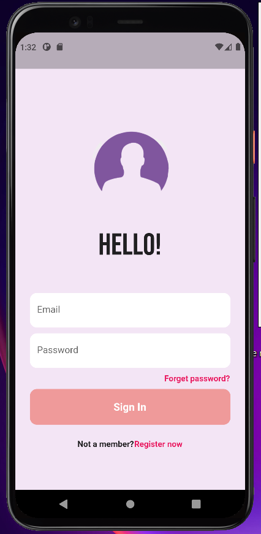
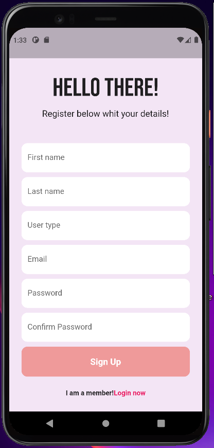
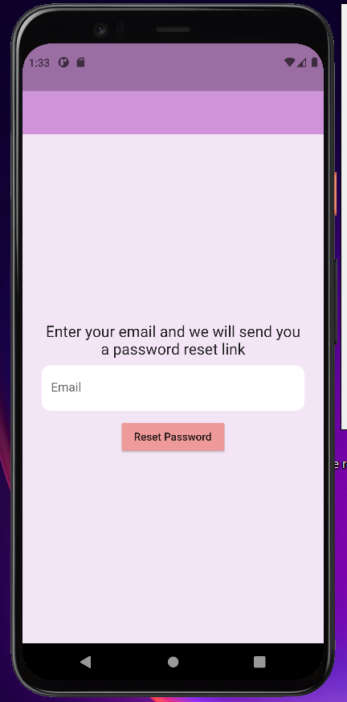

# Medical clinic app

## Documentation

&ensp; In this project I want to create an application for better communication between patients and doctors.For the moment, I have created a HomeScreen that has two button images where the consumer must choose which type of user he is. 
&ensp; I use widgets: Image.asset or Icon for the login UI and Firebase for the authentication process. As such, I have designed a page for creating an account and one for the password reset option. These are meant for all users, doctors as well as patients.

 

  

