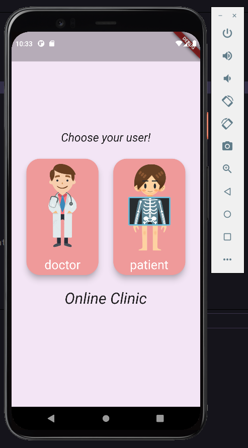
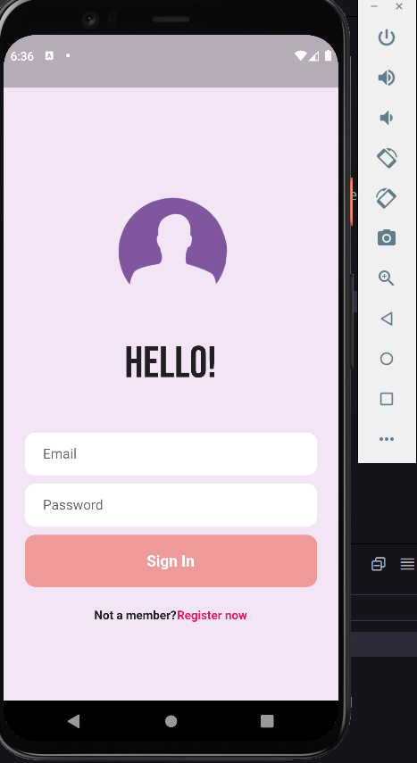
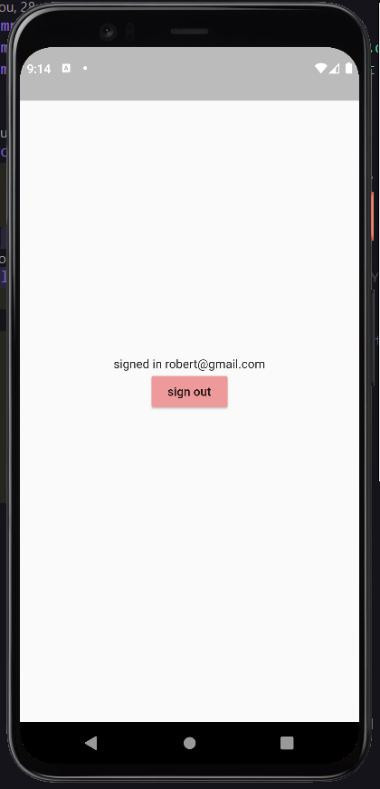

# clinica_medicala

## Documentation

&ensp; In this project I want to create an application for better communication between patients and doctors.For the moment, I have created a HomeScreen that has two button images where the consumer must choose which type of user he is. 
&ensp; I use widgets: Image.asset or Icon for the login UI and Firebase for the authentication process

 

